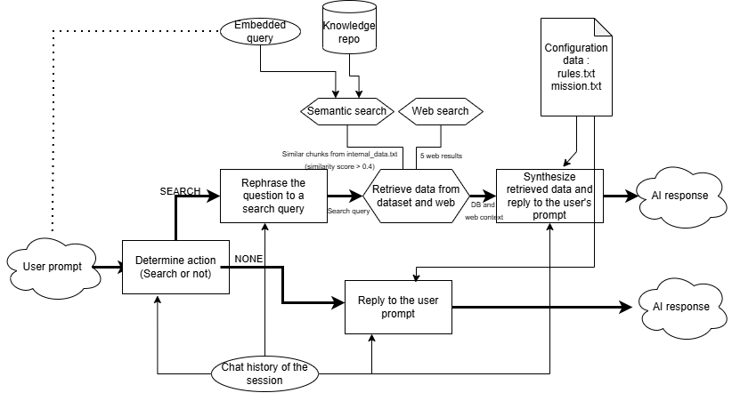

## Project's description :
A completely free RAG with searching capabilities for broke people.

## Architecture :



## Preconfiguration :
To ensure the chatbot works correctly, 
<ul>
<li>create a virtual environment via this command in the root directory :

```
python -m venv .venv
```
</li>
<li>Install Ollama

Follow the official installation guide:
https://ollama.com
</li>
<li>Pull the model

```
ollama pull llama3.2:3b 
```
PS : you can choose any model you like, I chose llama 3.2 3B because it works well on my machine.
</li>
<li>Install the requirements :

```
pip install -r requirements.txt
```
</li>
<li>Except if you want to keep working with the sample data, modify the internal_data.txt, configuration_data/mission.txt and configuration_data/rules.txt files depending on your needs.</li>

### VERY IMPORTANT STEPS :

<li>Run create_db_and_table to set your infrastructure with :

```
python create_db_and_table.py
```
</li>
<li>Run embeddings_generator with :

```
python embeddings_generator.py
```
</li>

## Running the app :
Now every time you want to run the app :
1. Activate ollama
2. Run the Flask app with this exact command in the root folder:

```
python -m Flask.app 
```
### Notes :
<br>
<li>Be specific if you want your chatbot to search something (it is quite dumb, mainly a prompt / routing issue).</li>
<li>No matter how long the conversation is, only 60 messages are displayed.</li>
<li>The chat history does not persist, it changes every session (new session_id = new empty thread).</li>
